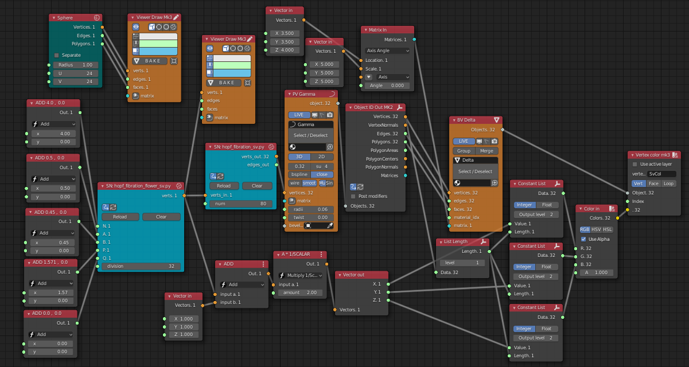

# Hopf fibration in Blender with add-ons

## Description

This project is inspired by https://github.com/nilesjohnson/hopf_fibration (https://nilesjohnson.net/hopf-production.html). The original fibration is written for [sagemath](https://www.sagemath.org) environment. This project repository aims to create the 3d fibration models in [Blender](https://www.blender.org).

## Installation

### With sverchok add-on

* Install Blender and [sverchok add-on](https://github.com/nortikin/sverchok).
* Enable the add-on with Menu->Edit->Preferences...-> add-ons.
* Open sverchok node editor, select Editor Type-> 'sverchok nodes', click '+ New' on header parts, push 'n' key to open side menu and open 'sverchok' tab.
* Import json files in this repository from the tab menu.

### With Animation nodes add-on

* Install Blender and [animation nodes add-on](https://animation-nodes.com).
* Enable the add-on with Menu->Edit->Preferences...-> add-ons.
* Open animation nodes editor, select Editor Type-> 'animation nodes', click '+ New' on header parts.
* Create node tree following images in this repository (Animation nodes add-on (2.1.7) used this time cannot import/export node trees in json format ).

## Usage

### With sverchok add-on

There are four types of fibration following the original source. Select each json file for your purpose. You can change parameters of each nodes at the left side of the each node tree.
#### hopf_fibration_greatcircle_sv.blend.json -> GreatCircle

|Image|Node tree|
|---|---|
|||
#### hopf_fibration_latitude_sv.blend.json -> Lattitude
|Image|Node tree|
|---|---|
|||
#### hopf_fibration_spiral_sv.blend.json -> Spiral
|Image|Node tree|
|---|---|
|||
#### hopf_fibration_flower_sv.blend.json -> Flower
|Image|Node tree|
|---|---|
|||

Next one is multiple version of lattice. 
#### hopf_fibration_multiple_latitudes_sv.blend.json -> Multiple Lattitudes
(**WARNING** this node tree may be broken when loaded because using too many nodes. If you encounter some erros, please recreate the nodes around the 'error' nodes (these nodes color will be changed if they have some errors))
|Image|Node tree|
|---|---|
|||

Additionally, there are python scripts for sverchok 'Script Node Lite' node. These can be used in your own node tree.
* hopf_fibration_sv.py
* hopf_fibration_greatcircle_sv.py
* hopf_fibration_latitude_sv.py
* hopf_fibration_spiral_sv.py
* hopf_fibration_flower_sv.py

### With Animation nodes add-on

To make the 3d models, create the node trees following images and using scripts in this repository.

#### Configuring script nodes

#### Fibration Loop (creating rings from original vertices)

#### Defining Colors from original vertex-locations

#### Mesh Instance Loop (Configuration of mesh objects with vertex color)

#### Spheres for original vertices

#### Great Circle Node Tree
|Image|Node Tree|
|---|---|
|||

#### Latitude Node Tree
|Image|Node Tree|
|---|---|
|||

#### Spiral Node Tree
|Image|Node Tree|
|---|---|
|||

#### Flower Node Tree
|Image|Node Tree|
|---|---|
|||

#### Multiple Latitude Node Tree
|Image|Node Tree|
|---|---|
|||

#### Script files

These are script files to make script node.
* hopf_fibration_sv.py
* hopf_fibration_greatcircle_sv.py
* hopf_fibration_latitude_sv.py
* hopf_fibration_spiral_sv.py
* hopf_fibration_flower_sv.py

## Requirements

* Blender 2.8 (or later)
* sverchok add-on 0.6 (or later)
* animation nodes add-on 2.1.7 (or later)
## Author

asahidari

## Licence

[GPL 3](https://www.gnu.org/licenses/quick-guide-gplv3.html)